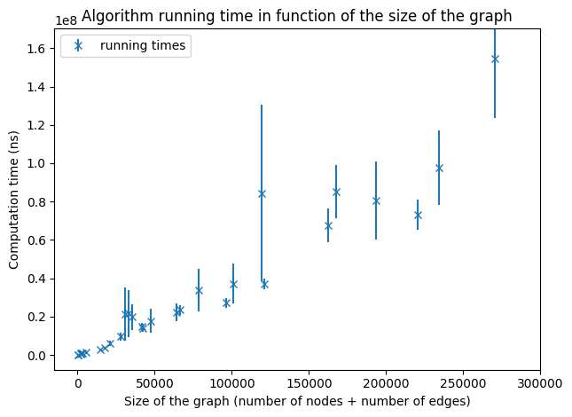

### MITRO209 Project
# Densest subgraph 2-approximation algorithm implemented with a linear temporal complexity

This project aims to implement the 2-approximation algorithm for the densest subgraph problem so that it runs in a linear time.

## I - Densest subgraph problem and 2-approximation algorithm definitions

For all this project, we will use the following definitions and notations:

> Given a graph *G = (V<sub>G</sub>, E<sub>G</sub>)*, we define:  
> - *&delta;<sub>G</sub>(v)* the degree of a node *v &in; V<sub>G</sub>* in the graph *G*.  
> - *&rho;(G) = |E<sub>G</sub>| / |V<sub>G</sub>|* the density of the graph *G*.  

The objective of the densest subgraph problem is to find *H* a subgraph of *G* that minimises *&rho;(H)*. 

The principle of the 2-approximation algorithm is the following: 

> *Input:* An undirected graph G = (V<sub>G</sub>, E<sub>G</sub>).  
> *Algorithm:*  
> 
> - Let *H = G*.  
> - While *G* contains at least one edge:
> - - Let *v* be the node with minimum degree in *G*.
> - - Remove *v* and all its edges from *G*.
> - - If *&rho;(G) > &rho;(H)* then *H ← G*.
> - Return *H*.  
> 
> *Output:* A 2-approximation densest subgraph of *G*.

It's proven that this algorithm returns a subgraph *H* of *G* that satisfies *&rho;(H) ≥ &rho;(O) / 2* where *O* is a densest subgraph of *G*.

This algorithm can be easily implemented with a quadratic complexity, or even with a complexity in *O(n\*log(n))*. In this project, we will implement this algorithm with a linear complexity.

## II - Implementation choices

### II-A. Programming languages

The complexity of the 2-approximation algorithm is highly dependent of the data structure used to represend the graph. Thus, we chose to code the core of the algorithm in Java, so that we can have a better management of types and data structures. However, we use Python to plot the results of the running times and to convert the downloaded files into a standardized version.

### II-B. Network dataset

I order to verify the complexity of our algorithm, we will use the [Stanford Large Network Dataset Collection](http://snap.stanford.edu/data/index.html). As our alrogithm applies on undirected graphs, we will use only their undirected graphs. We stored them in the [data downloaded folder](data/downloaded).

Since all the files downloaded don't have the same extensions, the same notations or the same conventions, we convert them, thanks to [this script](data/convertor.py), into another file stored [here](data/inputs) that will repect the following rules:

> - Each file has a `.edges` extension.
> - Each line of the file represents an edge of the graph.
> - Each line is composed of two numbers, that reprensents the ends of the edge, separated by a single space. Thus, for *x* and *y* two numbers, the line `x y` indicates that the graph has an edge between *x* and *y*.  
> - If the line `x y` is in the file, then there is also the line `y x`.

For instance, [this file](data/inputs/example.edges) represents the following graph:


The Python script that converts the data requires to have installed the following libraries:
- `networkx` used to build efficiently an undirected graph from the initial file without checking if one edge appears in the two sides in the file or not, and to iterate over each edge in order to write in the output file.
- `pickle` used to store the number of nodes and edges of each graph converted in the file `data/graph_sizes.bin`. The stored data will be used to plot the running time in function of the graph size without computing each time the graph size. 

### II-C. Graph representation

For the graph representation, we have the choice between the two main representations - adjacency matrix or adjacency list. Since a lot of manipulations on adjacency matrix have a quadratic complexity, we chose here to represent a graph by its adjacency list. The Java `Graph` class is defined [here](src/Graph.java#L10). We did not implement the basic operations on graphs, such as adding or removing a node because we wanted to implement only the methods needed for the algorithm. Also, we often use a direct access to the adjacency list `nodes` because it is easier to make sure the operations are in the complexity wanted. 

You may observe that the adjacency list `nodes` has the type `ArrayList<Node>` instead of `ArrayList<ArrayList<Integer>>`. Indeed, we created a class `Node`, defined [here](src/Node.java#L3), that allows each node to have a name. We made that choice because the [graphs from the dataset](#ii-b-network-dataset) do not have always the property of begining by the index 0. For instance, one of [these graphs](http://snap.stanford.edu/data/ego-Facebook.html) has only 52 nodes, and they have indexes between 594 and 4038. Thus, from any file of the dataset, we create a graph that has *n* nodes with indexes between *0* and *n-1*. This index is stored in the attribute `node.id` for an object `node` of the class `Node`. We also store the initial index in the attribute `node.name`, that can be any `String` object. With this representation, we can use the adjacency list `nodes` exactly as if it had the type `ArrayList<ArrayList<Integer>>`. The node `u = nodes.get(i)` at the index *i* in the adjacency list `nodes` has for neighbours `u.neighbours`, and its *k*<sup>th</sup> neighbour `v = u.neighbours.get(k)` has the index `v.id` in the adjacency list `nodes`, and has the name `v.name` in the initial file. Thus, the following assertion is always true:

> Let `g` be an instance of `Graph`.  
> Then for all integer *0 ≤ i ≤ n-1*, `g.nodes.get(i).id == i`.  

The creation of an object `Graph` from a file is done in the [constructor](src/Graph.java#L15), that takes the path to the file as argument. This transformation does not have a linear complexity. In fact, it is not possible to do it in a linear time because the indexes can be arbitrarily large. We are using the structure `HashMap` from `java.util` to build the graph, that adds new items with a linear complexity in the worst case (event if it is in constant time in average). 

Because of these considerations, we will not count this transformation in the complexity computing. Our algorithm applies on an object of the class `Graph` (basically a graph represented by its adjacency lsit) and returns another object of the class `Graph`. Our `Graph` structure has the property to store the initial names of the nodes, or else it would be useless to compute the densest subgraph.

## III - Core algorithm

### III-A. Overview of the difficult points to implement in linear time

Such as it is presented in the [first part](#i---densest-subgraph-problem-and-2-approximation-algorithm-definitions), the 2-approximation algorithm does not seem to be able to be implemented with a linear complexity.

Indeed, we iterate over each node to remove it from the graph. But, removing an item from a list is usually done in linear time. Moreover, we can not chose in witch order we remove the nodes, because the removed node must be of minimal degree. One can think of switching the node to remove with the last node of the adjacency list in order to remove it in a constant time, but the order of the nodes in an adjacency list is crucial. Also, to remove a node, we must find it. And finding an object in a list is an operation with linear complexity.

Furthermore, the node to remove at each iteration must be of minimal degree. That implies in one way or another sorting the nodes by degree. But sorting a list can not be done with a better complexity than logarithmic. So, we can not sort the nodes by degree at each iteration, whereas the degrees are bound to change at each iteration.

Also, at each iteration we compare the density *&rho;(G)* of the current iteration graph *G = (V<sub>G</sub>, E<sub>G</sub>)* to the density *&rho;(H)* of the densest subgraph so far *H*. That means computing the density *&rho;(G) = |E<sub>G</sub>| / |V<sub>G</sub>|* at each iteration. The computation of |E<sub>G</sub>| has a complexity in *O(|V<sub>G</sub>| + |E<sub>G</sub>|)* because we have to iterate over each node of the adjacency list, and for each node we have to iterate over each of its neighbours to find all the edges. Thus, if we are not careful, we can be led to do this computation at each iteration. 

Finally, at each iteration, if the current subgraph *G* satisfies *&rho;(G) > &rho;(H)* where *H* is the densest subgraph so far, we copy *G* in *H*. A copy of an object has necessary a complexity linear in the size of the object. Thus, we can not copy the gaph every time this condition is satisfied if we are aiming to implement the algorithm in linear complexity.

### III-B. Description of the implementation and linear complexity proof

#### III-B.1. Notations and conventions

In order to avoid confusions, in all code files and in all this report, we are using the following notations:

> `n` refers to a number of nodes.  
> `m` refers to a number of edges.  
> `d` refers to a degree.  
> `i`, `j` and `k` refer to indexes in the adjacency list.  
> `u`, `v` and `w` refer to nodes (objects of the class `Node`).  
> `p` refers to an index in a list of neighbours (`u.neighbours` for `u` a node).  

We will also stick to the following conventions:

> `i`, `j` and `k` refer respectively to the indexes in the adjacency list of `u`, `v` and `w`.  
> When we refer to nodes of a subgraph, we may add a `s` before the notations defined before. (*Example:* `su` node of index `si` in the subgraph).

#### III-B.2. Preliminary statements

The core algorithm can be found [here](src/Graph.java#L122) in the method `approxDensestSubgraph`. Before even starting the loop, we are making some preliminary statements that will help us during the loop. In this section, *G* will refer to the first graph, *G<sub>q</sub>* to the graph obtained at the *q*<sup>th</sup> iteration, *H<sub>q</sub>* to the graph with the maximum density within *G<sub>0</sub>*, ..., *G<sub>q</sub>*, and H to the graph returned by the algorithm, *i.e.* *H = H<sub>n</sub>*.

First of all, we intialize [two integers](src/Graph.java#L127), `n` and `m` that will always verify, at the end of the *q*<sup>th</sup> iteration:

> `n` = *|V<sub>G<sub>q</sub></sub>|*  
> `m` = *|E<sub>G<sub>q</sub></sub>|*  

 Right after, we intialize [all the arrays](src/Graph.java#L130) we will use, that we will describe later. This initialization is done is *O(|V<sub>G</sub>|)*. At the same time, [we fill the array of degrees](src/Graph.java#L139) `subDegrees` such that the *i*<sup>th</sup> element is equal to *&delta;<sub>G</sub>(v)* where `v = nodes.get(i)`.

In order to simplify the operations, our algorithm works only with integers. Then we first convert the adjacency list `nodes` of type `ArrayList<Node>` to a real adjacency list `subNodes` of type `ArrayList<ArrayList<Integer>>` in which the index *i* refers to the node *v* that satisfies `v.id == i`, *i.e.* to the *i*<sup>th</sup> node of `nodes`. [This transformation](src/Graph.java#L147) is done in *O(|V<sub>G</sub>| + |E<sub>G</sub>|)* because we iterate over each edge.

At the same time, we [fill a new array](src/Graph.java#L165), `degreeToNodes` that will link a degree *d* to all the nodes of degree *d*. Thus, `degreeToNodes.get(d)` is the list of nodes of degree *d*. This array gives us a kind of order by degree between nodes, and it will be used to find a node of minimum degree.

So far, we defined `subNodes`, `subDegrees` and `degreeToNodes` that must verify, at the end of the *q*<sup>th</sup> iteration:

> `subNodes` without the indexes removed so far (indexes in `removed`) is the adjacency list of *G<sub>q</sub>*.  
>  For all *i &in; V<sub>G<sub>q</sub></sub>*, `subDegrees.get(i)` = *&delta;<sub>G<sub>q</sub></sub>(i)*.  
> For all *i &in; V<sub>G<sub>q</sub></sub>*, *d = &delta;<sub>G<sub>q</sub></sub>(i)* if and only if *i* is in `degreeToNodes.get(d)`.

#### III-B.3. Removing a node

The main issue when we want to make this algorithm run with linear complexity is removing nodes from the graph. In fact, when we want to remove a node *u*, we have to remove *u* from all the neighbour lists of all its neighbours. 

We can remove an object from a list in *O(1)* if this item is the last one. We can verify this property by taking a look at the implementation of the method `remove` of the instances of `ArrayList`, that we can find in `java.utils.ArrayList.class` at the line 503:

```java
public E remove(int index) {
    Objects.checkIndex(index, size);
    final Object[] es = elementData;

    @SuppressWarnings("unchecked") E oldValue = (E) es[index];
    fastRemove(es, index);

    return oldValue;
}
```

And by jumping to the line 637 we find:

```java
private void fastRemove(Object[] es, int i) {
    modCount++;
    final int newSize;
    if ((newSize = size - 1) > i)
        System.arraycopy(es, i + 1, es, i, newSize - i);
    es[size = newSize] = null;
}
```

Thus, when we remove the last index (index equal to `size - 1` where `size` is the attribute that stores the size of the array), this function does not copy the array. It is therefore done in constant time.

We can now remove from a list any element of a given index by swapping its position with that of the last element. To perform that swap, we will use the class method `swap` from `java.util.Collections.class`. By taking a look at its implementation line 496, we can ensure that the swap is performed in constant time.

```java
public static void swap(List<?> list, int i, int j) {
    // instead of using a raw type here, it's possible to capture
    // the wildcard but it will require a call to a supplementary
    // private method
    final List l = list;
    l.set(i, l.set(j, l.get(i)));
}
```

Because the order is not relevant in the list of neighbours of a node, we can use this trick in `subNodes` to remove a node from the neighbours list at a given index in constant time. We will also use this trick to update `degreeToNodes` when a node loses one degree.

#### III-B.4. Introduction of trackers

With the trick described [above](#iii-b3-removing-a-node), we can remove from a list an  element at a given index. But when we want to remove a node `i` (confused with its index in `subNodes` because the algorithm is working with integers only), we must remove `i` from neighbour lists of all its neighbours. Let `j` (again confused with its index in `subNodes`) be a neighbour of `i`. We must remove `i` from `subNodes.get(j)`, that implies finding `i` in this list. But finding an element in a list can not be done in constant time. To address this issue, we are now introducing new objects that we will name here "trackers".

The "tracker" of `subNodes`, named `subNodesTracker` will track at any time the indexes of all nodes in all the neighbour lists. More precisely, `subNodesTracker` is an `ArrayList<ArrayList<Integer>>` such that at the *q*<sup>th</sup> iteration, for *i &in; V<sub>G<sub>q</sub></sub>*, for all *p* index of a neighbour of *i*, `subNodesTracker[i][p]` is the index of *i* in the neighbours list of `subNodes[i][p]`. We are using here the bracket notation for more clarety.

Thus, the following assertion is always true at the end of the *q*<sup>th</sup> iteration:

> For all *i &in; V<sub>G<sub>q</sub></sub>* and for all *0 ≤ p ≤ Card({j | (i, j) &in; E<sub>G<sub>q</sub></sub>})*,  
>  `subNodes[subNodes[i][p]][subNodesTracker[i][p]] == i`.

With that tracker, if we want to remove a node `i` from the neighbours of `j`, we can easily access to its index in `subNodes[j]` the list of neighbours of `j`. Indeed, because the graph is undirected, `j` is also in the neighbour list of `i`, and during the algorithm we define `j` by `j = subNodes[i][p]` for some integer *p*. Thus, the index sought is equal to `subNodesTracker[i][p]`. This "tracker" combined with the previous trick enables us to remove a node *i* from a list of neighbours of a neighbour of *i* in constant time.

Since we would also like to remove a node from `degreeToNodes`, we introduce another "tracker" named `degreeToNodesTracker` of type `ArrayList<Integer>`. This "tracker" is simpler than the previous one because each node appear only one time in `degreeToNodes`. At the end of the *q*<sup>th</sup> iteration, for a node *i &in; V<sub>G<sub>q</sub></sub>* of degree *d*, `degreeToNodesTracker[i]` is the index of *i* in the list of nodes of degree *d* `degreeToNodes[d]`.

Thus, the following assertion is always true at the end of the *q*<sup>th</sup> iteration:

> For all *i &in; V<sub>G<sub>q</sub></sub>*, `degreeToNodes[subDegrees[i]][degreeToNodesTracker[i]] == i`;

#### III-B.5. Inside the loop

The [main loop](src/Graph.java#L172) implements the only loop of the 2-approximation densest subgraph algorithm described in pseudo-code in the [first part](#i---densest-subgraph-problem-and-2-approximation-algorithm-definitions) with the tricks described in [III-B.3.](#iii-b3-removing-a-node) and [III-B.4.](#iii-b4-introduction-of-trackers) in order to ensure a linear complexity.

Since we can not remove an element from `subNodes` without making too costly operations, this loop will never remove any element from `subNodes`. It will instead build an `ArrayList<Integer>` named `removed` that stores the node removed at each iteration. More precisely, `removed.get(q)` is the node removed at the *q*<sup>th</sup> iteration. This loop will also [update when needed](src/Graph.java#L216) the integer `selectedIteration` that verifies at the end of the *q*<sup>th</sup> iteration the following assertion:

> *H<sub>q</sub> = G*<sub>`selectedIteration`</sub>

With these two objects, we can restore the nodes of *H* after the loop thanks to [an operation with a linear complexity](src/Graph.java#L222), and then build the subgraph *H*.

Let's dive into the loop.

First, we [remove a node of minimal degree](src/Graph.java#L174) from `degreeToNodes`. The node removed, named *i*, is always the last one, such that this operation is done in *O(1)*. We [make sure to add this node](src/Graph.java#L175) to `removed`.

Then we iterate over the neighbours of *i*. Let *j* be the *p*<sup>th</sup> neighbour of *i*. We must remove *i* from the neighbours of *j*. To do that, we [swap](src/Graph.java#L184) *i* with the last neighbour of *j*, which we name *k*, in the list of neighbours of *j* `subNodes[j]`. We can perform that swap because the index of *i* is stored in the tracker `subNodesTracker`. Indeed, this index is `subNodesTracker[i][p]` .We take care to update correctly the tracker `subNodesTracker` and then we [remove](src/Graph.java#L187) *i*, this operation is done in *O(1)* because *i* is now the last element of `subNodes.get[j]`.

The update of the tracker `subNodesTracker` is done in two steps. First, we shall do exactly the same [swap](src/Graph.java#L185) as we did in `subNodes`. Then, the index of *k* in the neighbours of *j* change, so we should update correctly the tracker. This index becomes the old index of *i*, namely `subNodesTracker[i][p]`. The index of *k* in the neighbours of *j* is stored in `subNodesTracker[k][subNodesTracker[j][neighboursCount - 1]]` where `neighboursCount - 1` is the last index of the neighbours of *j* (the old index of *k*). Thus, the [update made to the tracker](src/Graph.java#L183) preserves the properties of the tracker. We also moved *i* in the list of neighbours of *j*, then we should also update the tracker to update the index of *i* in the neighbours of *j*. But *i* will not appear in the next iterations because it is removed from the graph. So we do not perform this unnecessary operation.

Since we remove a neighbour to *j*, its degree changes. In fact it decreases by one. In the same way, we [remove](src/Graph.java#L198) *j* from the nodes of degre *d* where *d* is the former degree of *j* right after [swapping](src/Graph.java#L196) *j* with *k* the last node of degree *d* in `degreeToNodes[d]` to ensure an operation in *O(1)*. We also [update](src/Graph.java#L195) the tracker and we [modify](src/Graph.java#L200) `subDegrees` that stores the degree of each node.

We don't forget to update [*n*](src/Graph.java#L176) and [*m*](src/Graph.java#L188) correctly. We do it in *O(1)* because we know each time we remove a node or an edge, so it costs only one elementary operation for each node and edge. With these values of *n* and *m*, we can compute in *O(1)* the density of the new graph.

This algorithm iterates over each edge and node simultaneously, and performs operations in *O(1)* at each interation. That ensures a linear complexity. We will take apart the coputation of the complexity of the update of `minDegree` that stores the minimal degree of the graph, and the creation of the subgraph from the indexes of the subgraph.

#### III-B.5. Finding the minimal degree

At each step, [we remove a node of minimal degree](src/Graph.java#L174). The value of the minimal degree is stored in `minDegree` and it is updated when needed. If it is not done carefully, this update can lead to a program that is not with a linear complexity.

First of all, we [initialize](src/Graph.java#L162) `minDegree` at the same time as we initialize the differents arrays. So, it does not affect the complexity.

At each iteration, we remove at most one edge by node, except for the node we remove. Thus, the minimal degree can only degrease at most by one. However it can increases as much as possible, but can not exceed *|V<sub>G</sub>|* the number of nodes in the initial graph.

In order to find the new value of `minDegree`, we first [decrease](src/Graph.java#L206) `minDegree` by one, and then [increase](src/Graph.java#L208) `minDegree` by one while there is no node of degree `minDegree`. Since the minimal degree can only decrease by one at each iteration and it is bounded by *0* and *|V<sub>G</sub>|*, during the whole algorithm, `minDegree` will not by increased by one more than *2|V<sub>G</sub>|* times. Thus, finding the minimal degree does not impact the linear complexity of the algorithm.

#### III-B.6. Building the induced subgraph

So far, we have build a list of nodes that represents the node of the 2-approximation densest subgraph. Then, we have to build the induced subgrpaph. This operation is done [here](src/Graph.java#L77), in the method `subgraph` of the class `Graph`.

In order tu build the induced subgraph, we use a list named `subgraphIds` that stores the index *si* of a node *u* of index *i* from the parent graph in `subgraphIds.get(i)`. By iterating over each node, we first initialize each value to `NOT_YET_ADDED` or `NOT_IN_THE_GRAPH`, two special values, wether the node at the corresponding index should be in the subgraph or not. This operation is done in *O(|V<sub>G</sub>|)*.

Then, we iterate over each edge of the initial graph, and add the edge to the subgraph if and only if the two ends of the edge should be in the subgraph. Inside the loop, this operation is done in *O(1)*, because thanks to `subgraphIds`, we can know in constant time wether the current node should be in the subgraph or not. Also, when we add a node *u* to the subgraph by [adding it to the subgraph adjacency list](src/Graph.java#L101) `subgraphNodes`, we also [update](src/Graph.java#L100) `subgraphIds` such that `subgraphIds.get(u.id)` refers to its index in the subgraph ajdacency list. Thus, this node can be [found](src/Graph.java#L110) when needed in constant time.

Finally, from the initial graph, it has been proven that the algorithm builds a 2-approximation densest subgraph with a linear complexity.

## IV - Running times

## IV-A. Running time computation

To compute the running time, we compute the time elapsed during the [execution of the 2-approximation densest algorithm](src/Main.java#L45), *i.e.* during the execution of the method `approxDensestSubgraph` of the class `Graph`.


The function `runAllFilesInRandomOrder` from the file `Main.java` allows us to compute the running time of all the files in th folder [data/inputs](data/inputs) (see [an example of input](data/inputs/example.edges)). This function writes the subgraph found in the folder [data/outputs](data/outputs) with exactly the same name as the file in [data/inputs](data/inputs), and this output file respects the conventions described in [this](#ii-b-network-dataset) part (see [an example of output](data/outputs/example.edges)). The function also appends the running time of the algorithm in the folder [data/times](data/times) in a file with the same name as in [data/inputs](data/inputs) but with a `.time` extension (see [an example of running time file](data/times/example.time)). You can escape some files if your machine doesn't have enough memory to execute them by [adding](src/Main.java#L14) them to the list `filesTooLarge`.

In facts, because of the huge size of some graphs, if you don't have enough memory allocated to Java, you won't be able to execute the algorithm on the biggest graphs. You can modify the memory allocated to Java with the parameter `vmArgs`. For example, setting `vmArgs` to `-Xmx2G` will allocate 2GB of memory (that is enough for [this graph](http://snap.stanford.edu/data/soc-LiveJournal1.html)), whereas `-Xmx10G` will allocate 10GB of memory (that is enough for [this graph](http://snap.stanford.edu/data/com-Orkut.html)).

Because the running times may vary depending on the others tasks your computer runs at the same time, we recommend to execute `Main.java` several times. All the running times will be saved in the `.time` files in [data/times](data/times). Then, [this Python script](running-times/running_times.py) will plot the running times in function of the size of the graph from all the running times stored in [data/times](data/times), and it will store the results in the [images](images) folder as `.png` images begining with `runing-times` (from `runing-times-tiny.png` to `runing-times-huge.png` in function of the scale). The script plots the average running time, and also plots an error bar corresponding to the standard deviation. The Python script also does a linear regression and prints the correlation coefficient.

The Python script that plots the running times requires to have installed the following libraries:
- `networkx` for computing graph sizes with accuracy.
- `matplotlib` and `numpy` for plotting the running times.
- `pickle` to save the graph sizes in a file `graph_sizes.bin` in the folder `data` such that the size of the graph is only computed once.
- `sklearn.linearmodel` to compute the linear regression.

## IV-B. Results

After computing several times the running times of the algorithm on 44 different graphs of up to 117 million edges and 4 million nodes, we have some relevant results presented below.

  
*Running times on graphs of a size smaller than 300,000.* 

  
*Running times on graphs of a size smaller than 1,600,000.* 

The size of a graph G is defined by *|V<sub>G</sub>| + |E<sub>G</sub>|*. For small graphs (of size smaller than a few million) we can guess of a linear dependency as expected. But this sample of graphs is not sufficient to make any conclusion.

  
*Running times on graphs of a size smaller than 8,000,000* 

  
*Running times on graphs of a size smaller than 40,000,000.* 

As we increase the size of the graphs, we still observe a linear dependency even if the points are more scattered because of the lack of very large graphs. To verify the hypothesis of an implementation with a linear complexity, we will make a linear regression over the running times of all the graphs we have.

  
*Running times on graphs of a size smaller than 120,000,000.* 

As the correlation coefficient is enough close to 1, we can conclude that our implementation of the 2-approximation densest subgraph has actually a linear complexity.

## V - Conclusion

This project was an opportunity to dive into a subject in depth, and it was very challenging to think about solutions to implement the algorithm with a linear complexity.

Eventually, we implemented the algorithm, proved that it runs with a linear complexity and verified it on some entries. 

The current version of the algorithm uses a lot of space, so errors due tu memory allocation can occur on very big graphs. The memory used by the algorithm could be reduced by storing the tracked index along with the index in question. Thus, from two arrays we can reduce it to one array. But the structure would be more complex to understand. For more efficiency, we could have implemented this version, but in order to understand clearly the data structure it seems better to store apart the tracker.
